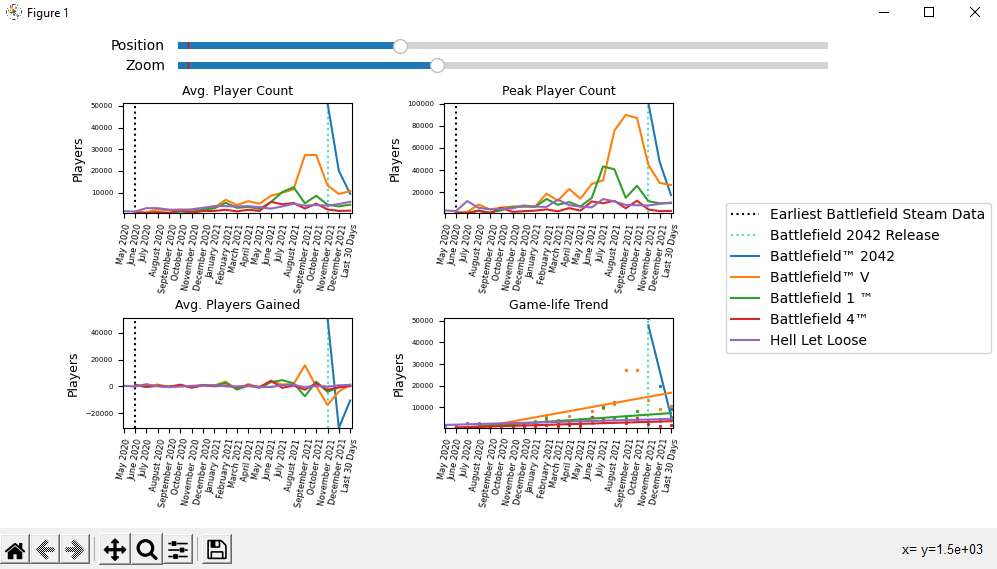
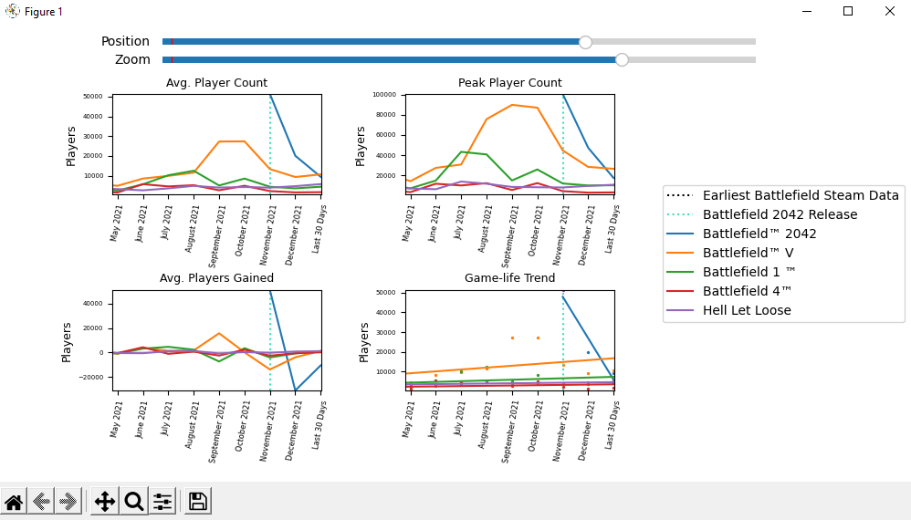

# Battlefield Player Count Tracker

Webscraper collecting Battlefield game data from <a href="https://steamcharts.com/">steamcharts.com</a>. Data is tracked and plotted to compare different Battlefield game analytics (player counts, player gains, etc).

## Tech stack 

- Python
- matplotlib
- pandas
- numpy
- BeautifulSoup

## Screenshots

  
